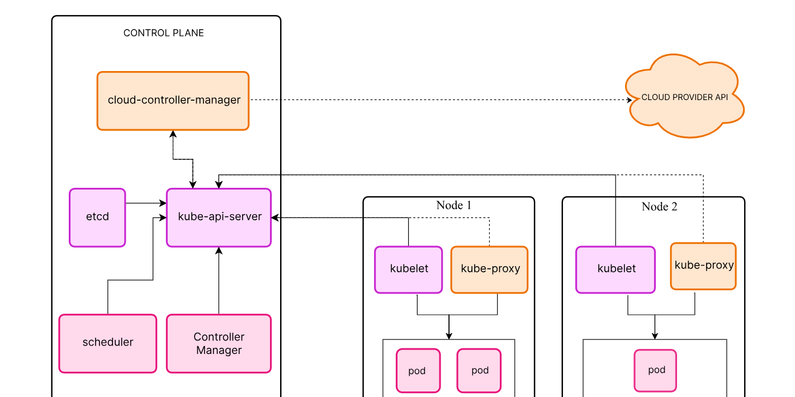

# Kubernetes Architecture

Welcome to the repository that explains the core **Kubernetes architecture**. This repo provides a beginner-friendly overview of how Kubernetes works internally, with diagrams, explanations, and key components clearly described.

---

## 📌 What is Kubernetes?

Kubernetes (also known as **K8s**) is an open-source platform for **automating deployment, scaling, and management of containerized applications**. It helps you run applications reliably across clusters of servers.

---

## 🧠 Core Concepts

### 🔹 Cluster

A **Kubernetes Cluster** is a set of machines (called nodes) where Kubernetes runs your applications. It has two main parts:

- **Control Plane** (Master Node)
- **Worker Nodes** (Minions)

---

## 🧭 Kubernetes Architecture Overview

### 1. **Control Plane Components**
These manage the whole cluster.

- **kube-apiserver**  
  The front-end for the Kubernetes control plane. All commands go through this API.

- **etcd**  
  A distributed key-value store used to store all cluster data.

- **kube-scheduler**  
  Decides which node will run a new pod.

- **kube-controller-manager**  
  Runs background tasks like replication and node monitoring.

- **cloud-controller-manager**  
  Connects your Kubernetes cluster to cloud provider APIs (e.g., AWS, Azure).

---

### 2. **Node Components**
These run on **each worker node** and are responsible for running containers.

- **kubelet**  
  Talks to the control plane and manages containers on its node.

- **kube-proxy**  
  Manages network rules for routing traffic to the correct pods.

- **Container Runtime**  
  Runs the actual containers (e.g., Docker, containerd, CRI-O).

---

## 📦 Kubernetes Object Model

- **Pod** – Smallest deployable unit (usually wraps one container)
- **Service** – Exposes your pods to the network
- **Deployment** – Manages replicas of pods for scaling and rolling updates
- **ConfigMap & Secret** – Used to store configuration and sensitive data
- **Namespace** – Provides virtual clusters in the same physical cluster

---

## 🔁 How It All Works (Simplified Flow)

1. You write a YAML file to define a deployment.
2. You apply it using `kubectl apply -f deployment.yaml`.
3. The **API server** receives the request and stores the desired state in `etcd`.
4. The **scheduler** picks a node to run the pod.
5. The **kubelet** on that node uses the container runtime to launch the pod.
6. The **kube-proxy** sets up the networking so your app is accessible.

---
## 📊 Kubernetes Architecture Diagram

Source: [cloudairy.com](https://cloudairy.com)

## 📚 References

- [Kubernetes Official Documentation](https://kubernetes.io/docs/home/)
- [Kubernetes Architecture - DigitalOcean](https://www.digitalocean.com/community/tutorials/an-introduction-to-kubernetes)
- [Kelsey Hightower's Kubernetes The Hard Way](https://github.com/kelseyhightower/kubernetes-the-hard-way)

---

## 🛠️ Contributions

Feel free to contribute by improving explanations or adding diagrams!

---
